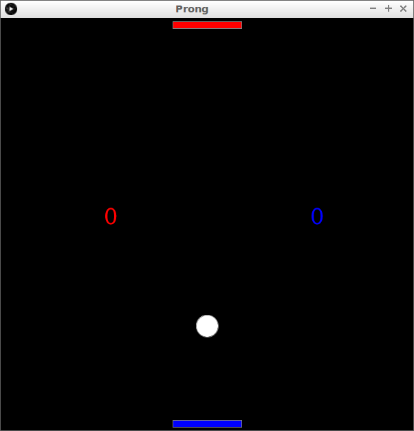

# Prong

Cooperative Pong game, written in Processing.

You can play the game at 
[the Prong page of richelbilderbeek his GitHub pages](http://richelbilderbeek.github.io/Prong/Prong.html).

## Gameplay

Prong ia cooperative Pong game.

Players 1 and 3 control the upper red paddle.
Players 2 and 4 control the lower blue paddle.

Goal is to never let the ball pass your team's paddle,
and to get the ball to pass the other team's paddle.

## Controls

 * `a`: player 1 left
 * `s`: player 1 right
 * `h`: player 2 left
 * `j`: player 2 right
 * `'`: player 3 left
 * `\`: player 3 right
 * arrow left: player 4 left
 * arrow right: player 4 right

